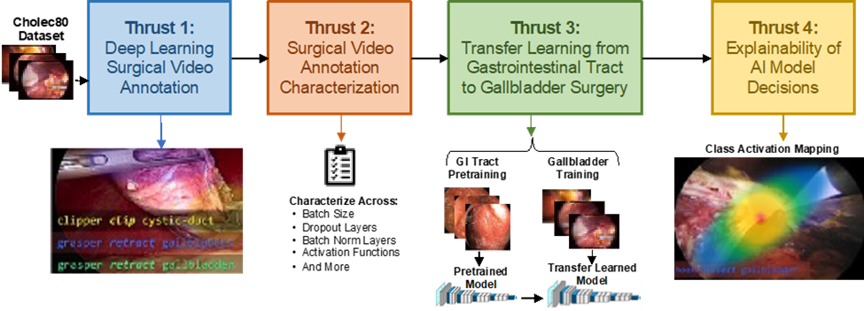
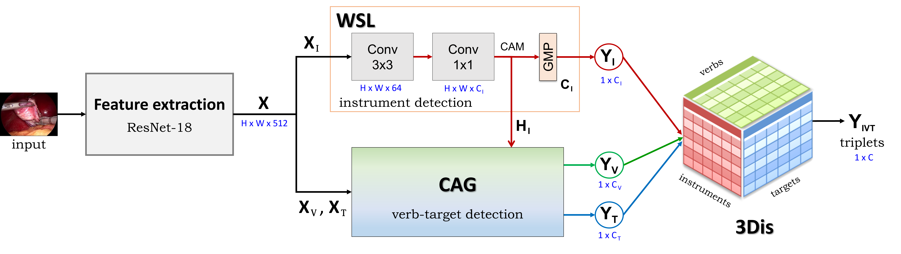
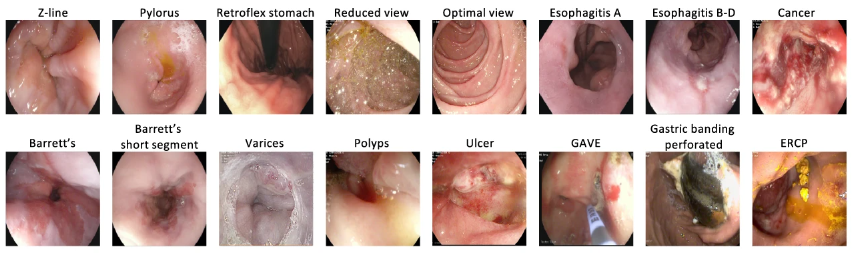
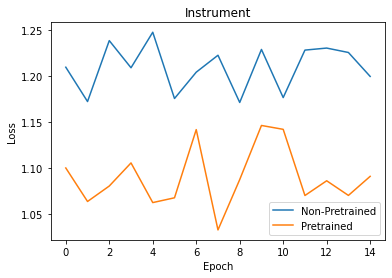
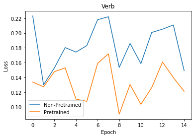
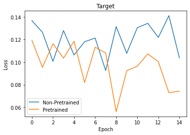
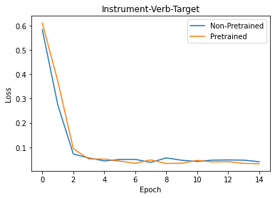

<div align="center">
<a href="http://camma.u-strasbg.fr/">

</a>
</div>

# COMS-6998: Applications of Deep Learning in Surgery
#### Alexander Ruthe (ayr2111) and Skyler Szot (sls2305)

## I. Project Description

Recent advances in minimally invasive surgery have yielded 
datasets of intraoperative video recordings, well
suited for deep learning applications. This project investigates
deep learning methods applied to laparoscopic cholecystectomy 
(gallbladder removal) surgery videos specifically, comparing feature
extraction architectures, characterize them in ways not explored in the published
literature, attempting to improve them with transfer learning, and 
applying human interpretable visual results based on class activation mapping. 

<div align="center">
<a href="http://camma.u-strasbg.fr/">

</a>
</div>


#### Dataset

The dataset used here is [CholecT45](https://github.com/CAMMA-public/cholect45) [1], a dataset of laparoscopic cholecystectomy surgical videos. The dataset contains 45 videos of cholecystectomy procedures collected in Strasbourg, France. The images are extracted at 1 fps from the videos and annotated with triplet information about surgical actions in the format of <instrument, verb, target>. There are 90,489 frames and 127,385 triplet instances in the dataset. An example of three frames for six different videos is shown below.

Each video is annotated with an action triplet containing at least one of each of 7 instruments, 11 verbs, and 15 tissues:

- **Instruments:** grasper, bipolar, hook, scissors, clipper, irrigator, null_instrument
- **Verbs:** grasp, retract, dissect, coagulate, clip, cut, aspirate, irrigate, pack, null_verb
- **Instruments:** gallbladder, cystic_plate, cystic_duct, cystic_artery, cystic_pedicle, blood_vessel, fluid, abdominal_wall_cavity, liver, adhesion, omentum, peritoneum, gut, specimen_bag, null_target

<div align="center">

</div>  

#### Thrust 1: Surgical Video Annotation

This project classifies the endoscopic surgical videos of [1] with action triplets of format (surgical
tool, surgical action, targeted tissue) listed above using a spatiotemporal deep learning architecture called TripNet [2]. 

The Tripnet model is composed of a feature extraction layer that provides input features to the encoder and decoder in the subsequent architecture. This feature extractor is studied further in thrust 2 by comparing fetaure extraction models and thrust 3 by evaluating transfer learning methods. 

<div align="center">

</div>

The TripNet model encoder encodes triplet components using a Weakly-Supervised Localization (WSL) layer that localizes the instruments. Moreover, the Class Activation Guide (CAG) detects the verbs and targets leveraging the instrument activations.

the TripNet decoder associates triplets from multi-instances, learning instrument-verb-target associations using a learning projection and for final triplet classification.

#### Thrust 2: TripNet Characterization

Affter establishing the model, we characterize the performance of it across different
deep learning configurations leveraging the [MLOps platform Weights and Balances](https://wandb.ai/site).
There we evaluate architecture configurations with the best evaluation accuracies across the following parameterizations.

- Batch Size: {64, 128, 256, 512, 1024}
- Image Augmentation: {Original, Vertical Flip, Horizontal Flip, Contrast, 90-degree Rotation}
- Learning Rate: {[0, 0.01, 0.01, 0.01], [0, 0.1, 0.1, 0.1], [0, 0.001, 0.001, 0.001]}

#### Thrust 3: Transfer Learning

Next, we implement a transfer learning method using a non-gallbladder tissue dataset, the 
gastrointestinal dataset [3], to pretrain the TripNet spatial feature extractor and
evaluate the change in performance for gallbladder surgical videos similar to [4]. 

<div align="center">
<a href="https://www.nature.com/articles/s41597-020-00622-y/figures/1">

</a>
</div>

#### Thrust 4: Explainability via Class Activation Mapping

Lastly, the project brings explainability of machine learning model decisions to surgical annotation
deep learning by pairing the deep learning network with class activation mappings (CAM) [5] to highlight areas of the image responsible for the classification decision. Ultimately this shows different emphasis areas in the same image for different classes (instrument, verb, tissue) which gives confidence the model is learning different and meaningful activations for each class. 


## II. Repository Description

The repsitory is a fork of [2] with additions to the data handling module, deep learning module, and main execution module. Moreover, custom scripts were added for class activation mapping and further model characterization. The basis structure of the repository is below. The `__checkpoint__` folder is used to automatically store the `.log` files recording the results and the `.pth` trained model files with examples shown for two separate test runs `100` and `101`. The results from the `.log` file are more conveniently stored in a `seaborn`-friendly csv format in the `pytorch/results/` folder, with examples shown from two tests. 

```
pdls-final-project/
├── pytorch
│   ├── __checkpoint__
│   │   ├── run_100
│   │   │   ├── tripnet_cholectcholect45-crossval_k1_lowres.log
│   │   │   └── tripnet_cholectcholect45-crossval_k1_lowres.pth
│   │   ├── run_101
│   │   │   ├── tripnet_cholectcholect45-crossval_k1_lowres.log
│   │   │   └── tripnet_cholectcholect45-crossval_k1_lowres.pth
│   ├── cam_mapping.py
│   ├── dataloader.py
│   ├── maps.txt
│   ├── network.py
│   ├── run.py
│   └── run_model_comparison.sh
├── results
│   ├── model_comparison_1_2_6_8.csv
│   └── model_comparison_4_5.csv
├── tensorflow_1.x
│   ├── dataloader.py
│   ├── maps.txt
│   ├── network.py
│   └── readme.md
└── tensorflow_2.x
    ├── dataloader.py
    ├── maps.txt
    ├── network.py
    └── readme.md

```

The repository supports TensorFlow 1.x, TensorFlow 2.x, and PyTorch, which are each in separate subdirectories under the main project directory. Within `pytorch`, the `cam_mapping.py` module provide class activation mapping utilities for explainability of the network's decisions. The `dataloader.py` module transforms and loads the gallbladder dataset and gastrointestinal dataset videos during training and inference. The `maps.txt` file maps integers to the string values of instruments, verbs, and targets in the decoder. The `network.py` file houses the feature extractor deep networks, the video encoder, and the video decoder described in [2]. The `run.py` module executes the experiment for the current configuration which is defined in `run_model_comparison.sh` for the main model comparison experiment. The scripts named as such in the TensorFlow modules do the same functions but in the Tensorflow API.

## III. Example Commands

#### System Requirements

The repository requires `Python >= 3.5` along with the following Python package dependencies.

Based on user's choice of Deep Learning Framework:
```
PyTorch >= 1.10.1
Torchvision >= 0.11
TensorFlow >= 1.10
TensorFlow >= 2.1
```

For all installations the following python packages are required:

```
sklearn
PIL
opencv-python-headless
ivtmetrics
```

#### Getting the Data

Download the data via wget or install axel if multiple cores available (`sudo apt-get install axel`):

```
wget -P data http://lnkiy.in/cholect45dataset

or 

axel -a -n 4 http://lnkiy.in/cholect45dataset
```

#### Generic Python Commands

The generic command to run train and evaluate a model on the endoscopic dataset is below. The code can be run in a training mode (`-t`), testing mode (`-e`)  or both (`-t -e`).

```
python3 run.py -t -e  --data_dir="/path/to/dataset" --dataset_variant=cholect45-crossval --kfold=1 --epochs=180 --batch=64 --version=2 -l 1e-2 1e-3 1e-4 --pretrain_dir='path/to/imagenet/weights'
```

After training a model, if a new evaluation is desired with a saved model, the model checkpoint path can be referenced in the command to evaluate that exisitng model:

```
python3 run.py -e --dataset_variant=cholect45-crossval --kfold 3 --batch 32 --version=1 --test_ckpt="/path/to/model-k3/weights" --data_dir="/path/to/dataset"
```

#### Example Python Command

The following command will train and evaluate a `ResNet-18` model on the `CholecT45` dataset specified by the `crossval` in `dataloader.py` and save all the results in the file `model_results.csv`. 

```
python3 ~/pdls-final-project/pytorch/run.py -t -e --data_dir="~/CholecT45" --csv_file="~/model_results.csv" --basename="resnet18" --dataset_variant=cholect45-crossval --kfold=1 --epochs=10 --batch=64 --version=0 -l 1e-2 1e-3 1e-4
```
#### Example Bash Command

In order to run the model comparison test across multiple models, run the shell script from the `/pdls-final-project/pytorch/` directory:

```
~/pdls-final-project/pytorch/ $: bash run_model_comparison.sh
```

The test will begin and the outputs will show the current model being trained/tested, the progress, and where artifacts are saved to:

```
------------------------------ Starting New Test ------------------------------
Model: Resnet18
Compute Device Assigned: Tesla V100-SXM2-16GB
Dataset Loaded: cholect45-crossval
Resnet18 Model Built
Metrics Built
Model Weights Loaded
Experiment started ...
   logging outputs to:  ./__checkpoint__/run_0/tripnet_cholectcholect45-crossval_k1_lowres.log
| resnet18 | epoch  1/10 | batch    0|
| resnet18 | epoch  1/10 | batch   10|
| resnet18 | epoch  1/10 | batch   20|
| resnet18 | epoch  1/10 | batch   30|
| resnet18 | epoch  1/10 | batch   40|
| resnet18 | epoch  1/10 | batch   50|
| resnet18 | epoch  1/10 | batch   60|
| resnet18 | epoch  1/10 | batch   70|
| resnet18 | epoch  1/10 | batch   80|
| resnet18 | epoch  1/10 | batch   90|
| resnet18 | epoch  1/10 | batch  100|
```


## IV. Results

#### Feature Extraction Comparison

- Table of IVT Metrics from csv
- Charts of IVT metrics from csv
- CAM maps across different models for same image/class

#### Model Characterization

We characterized the performance of the tripnet model across different deep learning configurations, leveraging the MLOps platform Weights and Biases. We conducted a  hyperparameter sweep for 10 epochs across 18 random combinations of the following:

- Batch Size: {64, 128, 256, 512, 1024}
- Image Augmentation: {[Original], [Original, Vertical Flip, Horizontal Flip, Contrast, 90-degree Rotation]}
- Learning Rate: {[0.1, 0.1, 0.1], [0.01, 0.01, 0.01], [0.001, 0.001, 0.001]}

- Batch size indicates the number of samples to propogate through the network.
- Image augmentation indicates the data augmentations to be applied to each sample. This was configured as a binary setting of data augmentation or no data augmentation. The data augmentations used were Vertical Flip, Horizontal Flip, Contrast, and 90-degree Rotation. It is also possible to use any combination of these augmentations, but this was done for simplicity. 
- Learning rate indicates the step size of each weight update. The learning rates are shown as triplets, because there is a separate learning rate for instrument, verb, and target. It is possible to have a different learning rate for each, but they were kept the same for simplicity.

We also reduced the number of videos from 50 to 10 for the hyperparameter sweep to minimize training time and cost. When using the entire dataset of 50 videos, a single epoch takes ~12 minutes on a V100 GPU. Conducting a sweep of 18 combinations with 10 epoch each would take ~36 hours on a V100 GPU, which was too long for the scope of this project.

The hyperparameter sweep results can be found here on W&B: https://wandb.ai/skyler-szot/uncategorized?workspace=user-skylers27

<div align="center">

</div>
<div align="center">

</div>
<div align="center">

</div>
<div align="center">

</div>
<div align="center">

</div>

#### Transfer Learning

A key part of the tripnet model training is the ResNet feature extractor. The feature extraction layer is responsible for extracting high and low level features from each input image from a surgical video. These features are utilized in the tripnet model for instrument, verb, and target classification. One possibility to improve the models accuracy and convergence is transfer learning. Rather than training the ResNet feature extractor from scratch, it is possible to initialize with pretrained weights that share some high-level features with the target dataset (CholecT45). We utilized the ImageNet-1K pretrained weights as the starting point for our transfer learning task with a ResNet-18 feature extractor. ImageNet is a dataset containing more than 14M images and 22K categories, while ImageNet-1K contains the same 14M images, but is reduced to just 1K high-level categories. We hoped that the ImageNet-1K dataset would share many of the same high level features as the CholecT45 dataset, and might provide an improvement in convergence and accuracy.

We investigated two identical training schemes using the default hyperparameters for 15 epochs, changing only the ResNet-18 feature extractor pretraining. We recorded the loss for instrument, verb, and target individually, as well as the IVT triplet loss. The results are shown below:

<div align="center">

</div>
<div align="center">

</div>
<div align="center">

</div>

<div align="center">

</div>

As we can see in the graphs above, pretraining provided significant improvement for all three classification tasks individually, reaching a lower loss in all cases. This means that the ImageNet-1K pretrained weights provided useful high level features as a basis for fine-tuning on the individual tasks. However, there appears to be little improvement in the loss for IVT triplet classification as a result of pretraining. Correctly identifying a triplet of instrument, verb, and target is a much more complex task, and the ImageNet-1K pretraining provided no improvement.

#### Class Activation Mapping

Each class requires a different feature extractor activation. Intuitively, identifying the surgical instrument will require different features than identifying the target tissue. In order to evaluate the models' ability to make decisions with this intuition, the class activation maps for each class type (instrument, verb, tissue) for the same image are compared. It's clear from the comparison with a ResNet-18 below that the model is learning to extract different features for each class type. 

<div align="center">

</div>

This comparison is done for a larger model, a ResNet-50, and a smaller model, a SqueezeNet, to show that the features learned per class type are mostly agnostic to the architecture and more specific to the class type. Specifically in this video frame, all models show instrument class activation as a large central feature over one or both of the surgical tools. The verb class type has a more sporadic activation map across all models which is intuitive because the model is looking at moving components. Lastly, the tissue class activation map is more interleaved between the tools, seemingly focusing on the background tissue. 

<div align="center">

</div>

<div align="center">

</div>

#### Example Tables
Dataset ||Components AP ||||| Association AP |||
:---:|:---:|:---:|:---: |:---:|:---:|:---:|:---:|:---:|:---:|
.. | AP<sub>I</sub> | AP<sub>V</sub> | AP<sub>T</sub> ||| AP<sub>IV</sub> | AP<sub>IT</sub> | AP<sub>IVT</sub> |
CholecT40 | 89.7 | 60.7 | 38.3 ||| 35.5 | 19.9 | 19.0|
CholecT45 | 89.9 | 59.9 | 37.4 ||| 31.8 | 27.1 | 24.4|
CholecT50 | 92.1 | 54.5 | 33.2 ||| 29.7 | 26.4 | 20.0|

<br />

| Network   | Base      | Resolution | Dataset   | Data split  |  Link             |
------------|-----------|------------|-----------|-------------|-------------------|
| Tripnet   | ResNet-18 | Low        | CholecT50 | RDV         |   [Google] [Baidu] |
| Tripnet   | ResNet-18 | High       | CholecT50 | RDV         |   [Google] [Baidu] |
| Tripnet   | ResNet-18 | Low        | CholecT50 | Challenge   |   [Google] [Baidu] |


# V. References

[1] A.P. Twinanda, S. Shehata, D. Mutter, J. Marescaux, M. de Mathelin, N. Padoy, EndoNet: A
Deep Architecture for Recognition Tasks on Laparoscopic Videos, IEEE Transactions on Medical
Imaging (TMI), arXiv preprint, 2017

[2] Nwoye, Chinedu Innocent, et al. "Recognition of instrument-tissue interactions in endoscopic
videos via action triplets." International Conference on Medical Image Computing and
Computer-Assisted Intervention. Springer, Cham, 2020.

[3] Borgli, Hanna, et al. "HyperKvasir, a comprehensive multi-class image and video dataset for
gastrointestinal endoscopy." Scientific data 7.1 (2020): 1-14.

[4] Christodoulidis, Stergios, et al. "Multisource transfer learning with convolutional neural
networks for lung pattern analysis." IEEE journal of biomedical and health informatics 21.1
(2016): 76-84.

[5] Selvaraju, Ramprasaath R., et al. "Grad-cam: Visual explanations from deep networks via
gradient-based localization." Proceedings of the IEEE international conference on computer
vision. 2017.
